## CDN, Route53, CloudFront, s3, Certificate Manager
# Diagrama
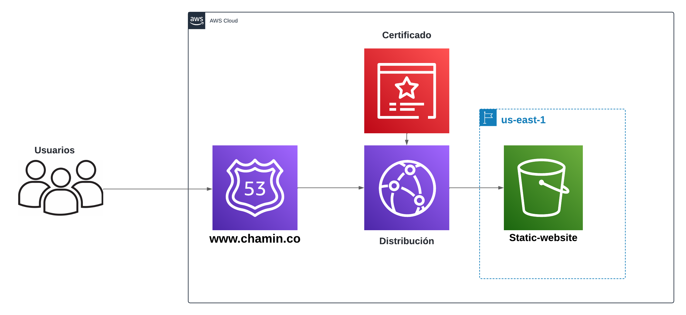

## Objetivo
Implementar una infraestructura de entrega de contenido altamente escalable, segura y de baja latencia utilizando los servicios de AWS. El objetivo principal es mejorar la disponibilidad y el rendimiento de un sitio web estático mediante la integración de las siguientes tecnologías:

**S3**: Servir como almacenamiento seguro y escalable para los archivos estáticos del sitio web, como HTML, CSS, JavaScript, e imágenes.

**CloudFront**: Distribuir el contenido almacenado en S3 a usuarios de todo el mundo con baja latencia, mediante una red global.

**Route 53**: Gestionar el DNS del dominio del sitio web, garantizando una resolución de nombres rápida y confiable y redirigiendo el tráfico a la distribución de CloudFront.

**Certificate Manager**: Proveer un certificado SSL/TLS para asegurar la comunicación entre los usuarios y CloudFront, utilizando HTTPS para proteger la integridad y la privacidad de los datos en tránsito.

## Resultados Esperados
Rendimiento Mejorado: Entrega rápida de contenido con baja latencia gracias a la red global de CloudFront.
Alta Disponibilidad: Resiliencia frente a fallos regionales mediante la distribución de contenido a través de múltiples ubicaciones de CloudFront.
Seguridad: Protección del contenido con HTTPS, asegurado mediante un certificado SSL gestionado automáticamente por AWS Certificate Manager.
Escalabilidad: Capacidad de manejar un alto volumen de tráfico sin intervención manual, utilizando la infraestructura escalable de AWS.

## Sections
- [01-Crear bucket s3]
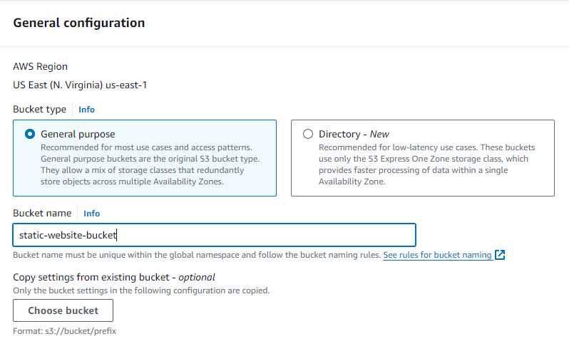
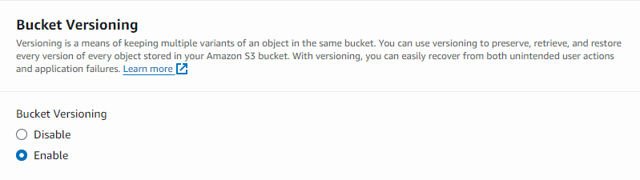

- [02-Crear distribución de CloudFront]
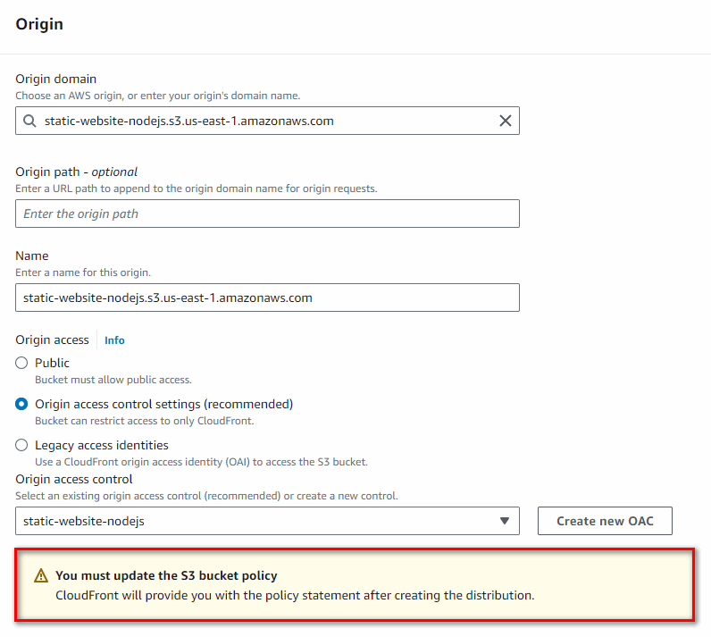
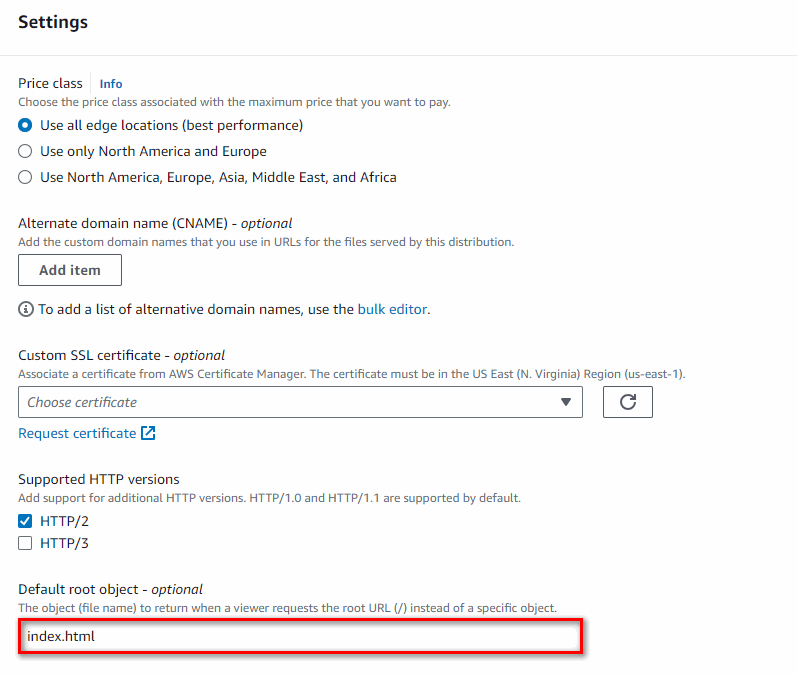
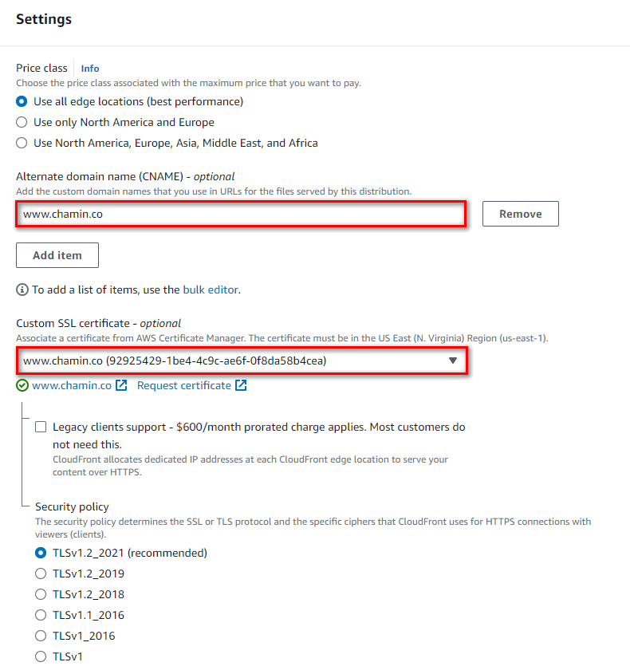

- [03-Crear HostedZone]
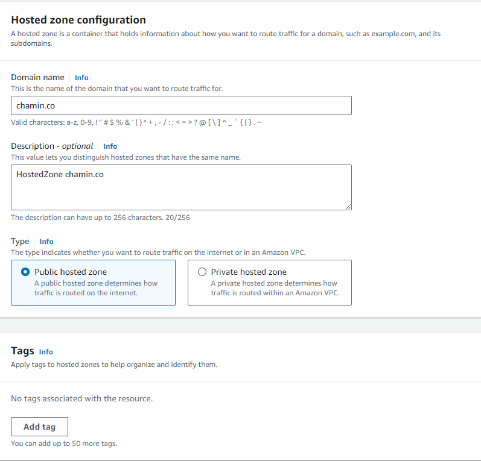
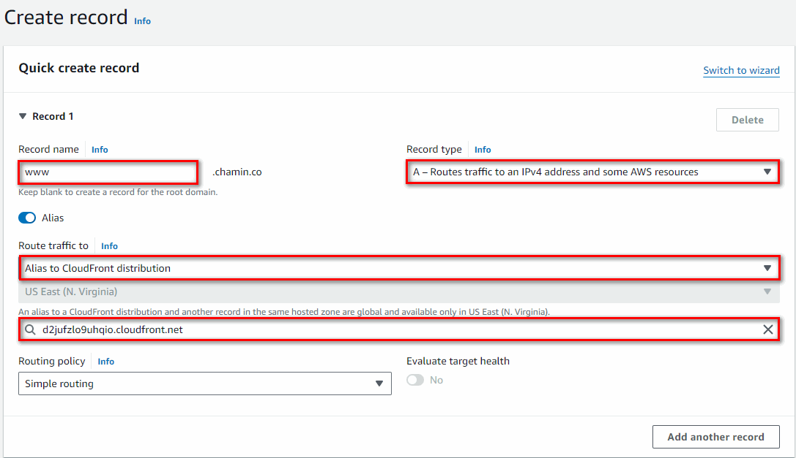

- [04-Crear Certificado]
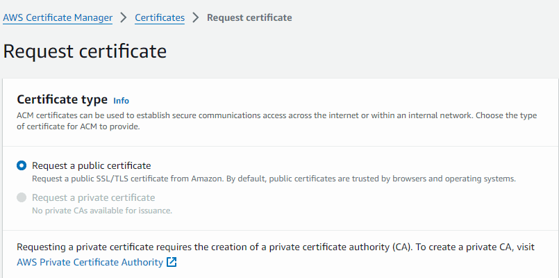
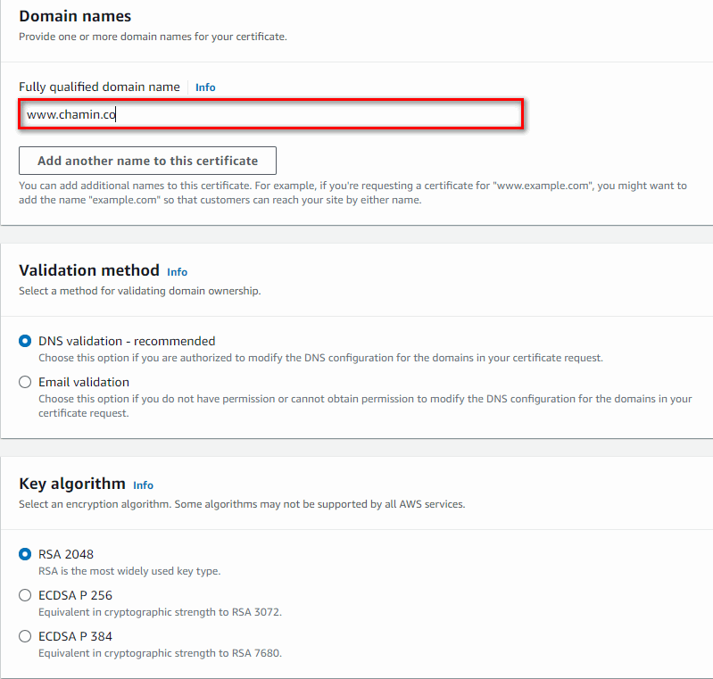
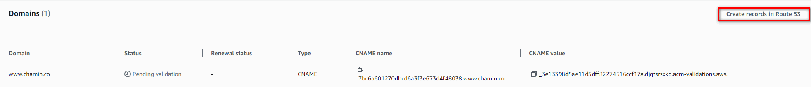
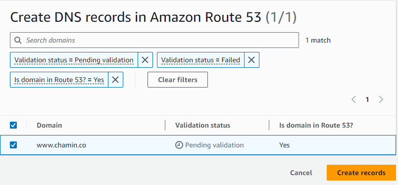
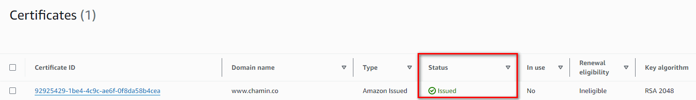
