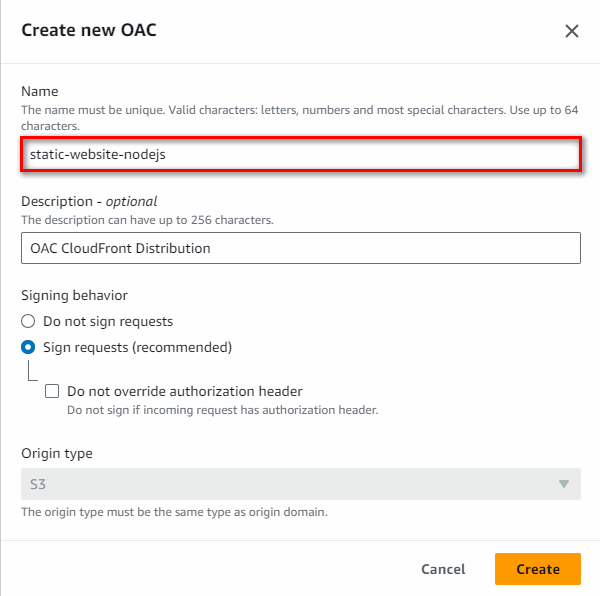
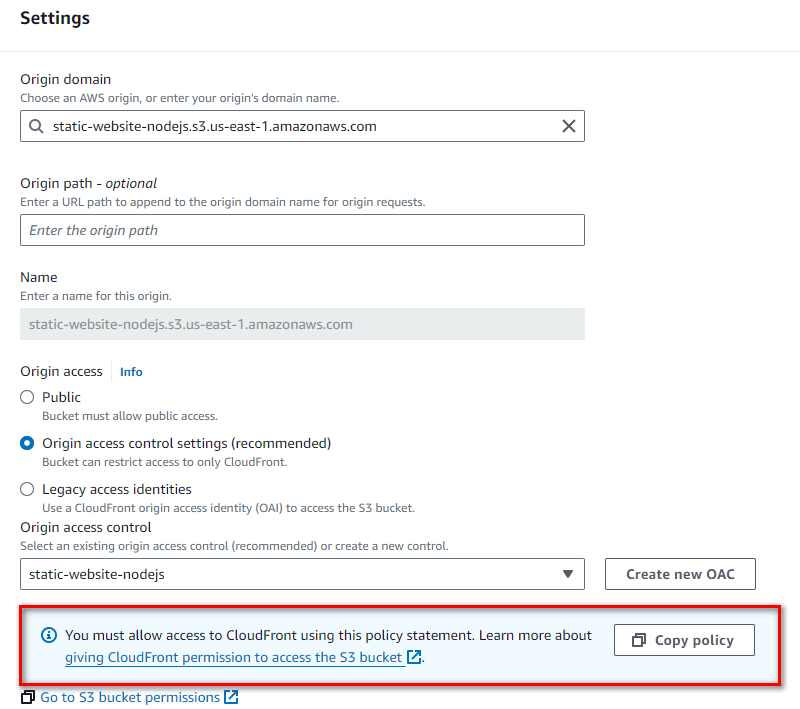

## CDN, Route53, CloudFront, s3, Certificate Manager

# Sections
- [00-Diagrama]

- [01-Crear bucket s3]

- [02-Crear distribución de CloudFront]

- [03-Crear HostedZone]

- [04-Crear Certificado]

